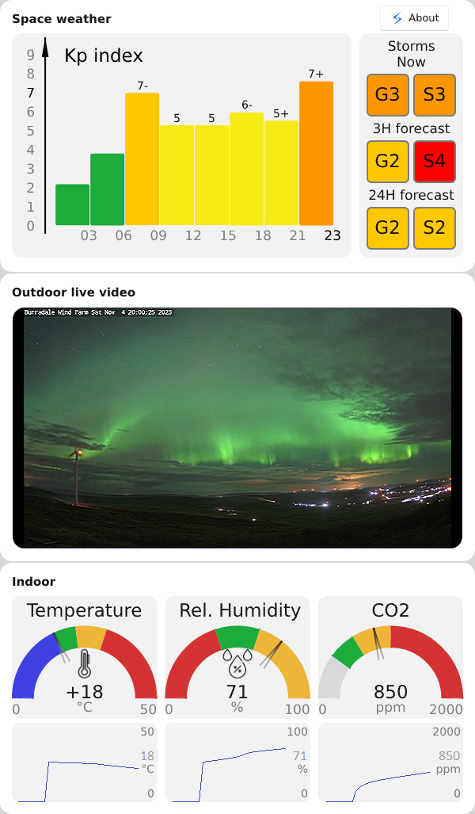

## GUI for home meteostation based on Slint with space weather, MQTT connections and live video



### Description

GUI made on Slint for fixed resolution 600x1024.

Displays
- space weather parameters
    - 24H Kp index history
    - Geomagnetic and Solar Radiation storm icons
- some live video
- current indoor parameters and 24H history charts for
    - Indoor temperature
    - relative humidity
    - CO2

Sensors's and space weather data gets via MQTT broker from 'Weather Provider' https://github.com/TEPOTPOH/mqtt-weather-provider .

MQTT data inputs:
- Tepmerature and rel. humidity sensor HTU21D
- CO2 sensor MHZ19B
- NOAA Kp index instant data
- NOAA Kp index history data
- NOAA Solar Radiation flux data
- NOAA space weather forecast: Geomagnetic Storms, Solar Radiation Storms

Video pipline made on Gstreamer. Pipline looks like this:
`Uridecodebin -> videorate -> videoconvert -> videoscale -> appsink`.
Based on Slint example https://github.com/slint-ui/slint/tree/master/examples/gstreamer-player

### Configuration

- Use environment variable `MQTT_BROKER_HOST` to set MQTT broker host. By default it is `localhost`.
- Use environment variable `MQTT_BROKER_PORT` to set MQTT broker port. By default it is `1883`.
- Use environment variable "VIDEO_URL" to set live video source, by default it is `https://zetcast-gb.b-cdn.net/cf_burradale/BurradaleABR/burradale/stream_720p/chunks.m3u8`.

### Building and Running

You will need to have the gstreamer libraries used by gstreamer-rs installed.

https://gstreamer.pages.freedesktop.org/gstreamer-rs/stable/latest/docs/gstreamer/

On Debian/Ubuntu you can use:

```
$ apt-get install libgstreamer1.0-dev libgstreamer-plugins-base1.0-dev \
      gstreamer1.0-plugins-base gstreamer1.0-plugins-good \
      gstreamer1.0-plugins-bad gstreamer1.0-plugins-ugly \
      gstreamer1.0-libav libgstrtspserver-1.0-dev libges-1.0-dev
```

Once you have a working gstreamer-rs and slint install, `cargo run` should work.

### TODO:
- [ ] Show weather forecast from Windy or Yandex Weather
- [ ] Configure user name and password for MQTT broker
